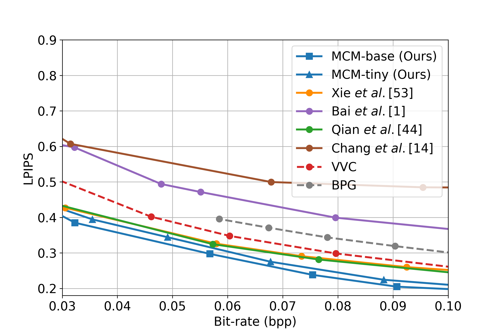
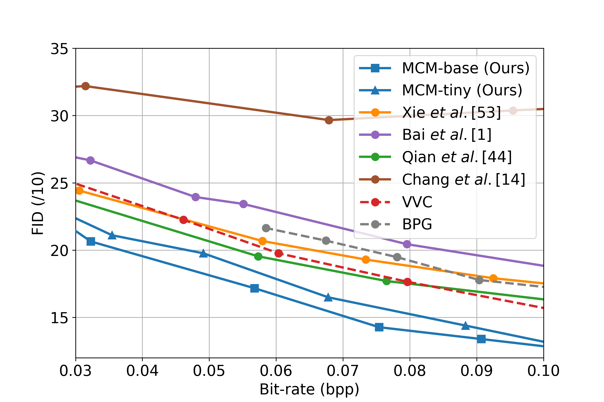

# MCM

This is the Pytorch implementation of the paper "**You Can Mask More For Extremely Low-Bitrate Image Compression**". 
[[Arxiv Paper](https://arxiv.org/abs/2306.15561)]

This repo defines the **Masked Compression Model
(MCM)** for extremely low-bitrate image compression in the paper above.


# To-do List
- Release MCM checkpoints
- Release more lightweight variant models

# Dependencies and Installation
<!-- ```
conda create -n MCM python=3.7
conda activate MCM
pip install compressai
pip install pybind11
git clone https://github.com/lianqi1008/MCM.git
cd MCM
pip install -e .
pip install -e '.[dev]'
``` -->

```
conda create -n MCM python=3.7
conda activate MCM
git clone https://github.com/lianqi1008/MCM.git
cd MCM
pip install -r requirements.txt
python setup.py install
```
# Get Started

## Preparation
We provide code examples on the COCO dataset.

### 1. Create Required Directories

```bash
mkdir dataset/coco/images
mkdir dataset/coco/scores
mkdir dataset/coco/structure
```
### 2. Dataset

- **Download:** [MS COCO 2014 Dataset](https://cocodataset.org)
- **Get Annotations:**

    ```
    python util/binary_segmentation.py --coco_dir COCO_VAL_DIR --annotation_file COCO_VAL_ANNO_FILE --image_dir path/to/imageDir --segm_dir path/to/strcutureDir
    e.g., python util/binary_segmentation.py --coco_dir COCO_VAL_DIR --annotation_file COCO_VAL_ANNO_FILE --image_dir ./dataset/coco/images/test --segm_dir ./dataset/coco/strucure/test
    ```
    **Note:** We randomly sample 200 images from the val set as our test set and the relevant code already exists in `util/binary_segmentation.py`.


### 3. Generate Patch Complexity Scores for DA-Mask

```
python util/score_cal.py -d0 path/to/imageDir -d1 path/to/strcutureDir -d2 path/to/scoresDir
e.g., python util/score_cal.py -d0 ./dataset/coco/images/test -d1 ./dataset/coco/structure/test -d2 ./dataset/coco/scores
```

The final file structure is as follows:

```
checkpoint
    |- pretrained
        |- pretrained.pth
    |- finetuned
        |- coco
            |- xxx.pth
            |- ...
        |- celeba
dataset
    |- coco
        |- images
            |- train
            |- test
        |- scores
        |- structure
    |- celeba
```

Note: The three folders below the 'dataset/coco' have the same subfolders, both 'train' and 'test', in which the corresponding images are placed. The folder structure of 'dataset/celeba' is consistent with that of 'dataset/coco'.
## Train
Train from scratch and please download the pre-trained model from [MAE's repo](https://github.com/facebookresearch/mae). And please put it in ./checkpoint/pretrained/.

```
CUDA_VISIBLE_DEVICES=0 python main_compress.py \
-m MCM -d ./dataset/coco -e 100 --batch_size 32 \
--checkpoint ./checkpoint/pretrained/pretrain_vit_base.pth \
--output_dir dirpath/to/save/checkpoint \
--log_dir dirpath/to/save/logs --cuda
```

## Inference
Note that '--exp_name' is the location where the bit stream of the token index is saved, you can name it arbitrarily, and you can delete the folder after inference, which is not important.

"Inference on GPU is not recommended for the autoregressive models (the entropy coder is run sequentially on CPU)."(mentioned in CompressAI), so please run on CPU for inference.
```
CUDA_VISIBLE_DEVICES=0 python -m compressai.utils.eval_model \
-a MCM -d './dataset/coco/' -r dirpath/to/output \
-p './checkpoint/finetuned/coco/checkpoint_xxx.pth' \
--exp_name coco --vis_num 144 --cuda
```

# MCM-Tiny
MCM-Tiny(50M) is a lightweight version of MCM(200M), built on [MAE-Tiny](https://arxiv.org/abs/2205.14443). You can download the pre-trained model from [MAE-Lite's repo](https://github.com/wangsr126/MAE-Lite). The training and inference steps for MCM-Tiny are the same as for MCM.
<!-- 
# Checkpoints
| Method | Dataset | Link | Dataset | Link | 
| ---- | ------ | ------ | ------ | ------ |
| MCM | COCO | [cnn_0035]() | CelebAMask-HQ | [cnn_0035]() |
| MCM | COCO | [cnn_0035]() | CelebAMask-HQ | [cnn_0035]() |
| MCM | COCO | [cnn_0035]() | CelebAMask-HQ | [cnn_0035]() |
| MCM | COCO | [cnn_0035]() | CelebAMask-HQ | [cnn_0035]() |
| MCM | COCO | [cnn_0035]() | CelebAMask-HQ | [cnn_0035]() |
| MCM-Tiny | COCO | [cnn_0035]() | CelebAMask-HQ | [cnn_0035]() |
| MCM-Tiny | COCO | [cnn_0035]() | CelebAMask-HQ | [cnn_0035]() |
| MCM-Tiny | COCO | [cnn_0035]() | CelebAMask-HQ | [cnn_0035]() |
| MCM-Tiny | COCO | [cnn_0035]() | CelebAMask-HQ | [cnn_0035]() | -->

# Results on COCO


<!-- ### Qualitative Results -->
<!--  -->
<!-- 
 -->


<!-- ### Quantitative Results
RD performance on CelebAMask-HQ dataset.

 -->

<!-- RD performance on COCO dataset.

 -->


# Citation
```
@misc{li2023mask,
      title={You Can Mask More For Extremely Low-Bitrate Image Compression},
      author={Anqi Li and Feng Li and Jiaxin Han and Huihui Bai and Runmin Cong and Chunjie Zhang and Meng Wang and Weisi Lin and Yao Zhao},
      year={2023},
      eprint={2306.15561},
      archivePrefix={arXiv},
      primaryClass={cs.CV}
 }  
```
# Related Links
MAE: https://github.com/facebookresearch/mae.git  
CompressAI: https://github.com/InterDigitalInc/CompressAI  
Tensorflow compression library: https://github.com/tensorflow/compression  
MS COCO Dataset: https://cocodataset.org  
CelebAMask-HQ Dataset: https://github.com/switchablenorms/CelebAMask-HQ  