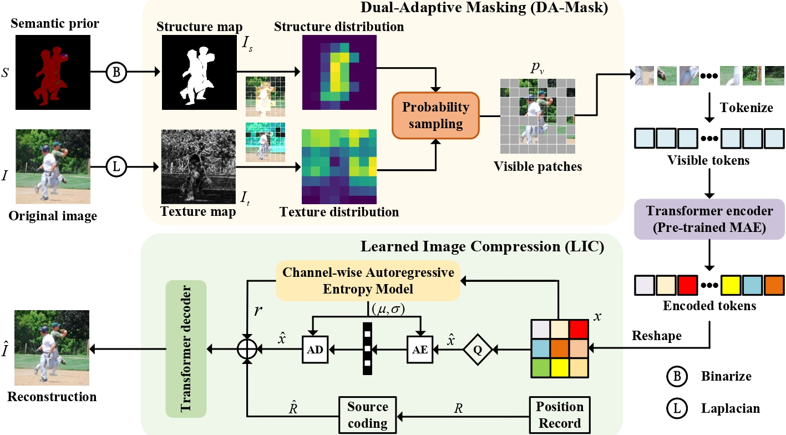
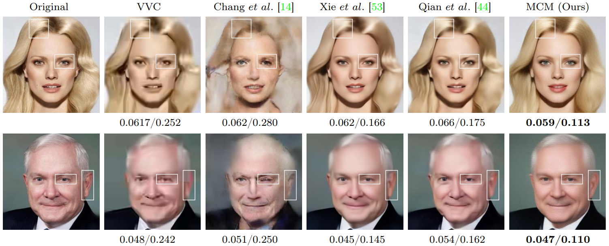
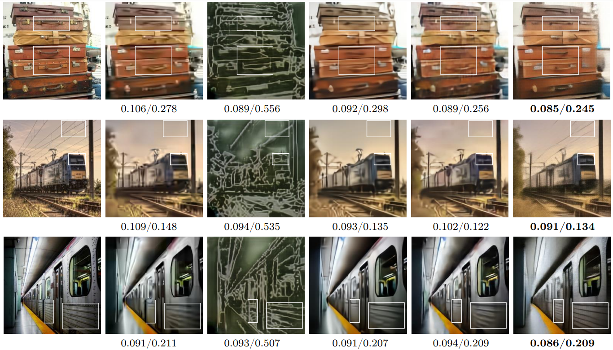
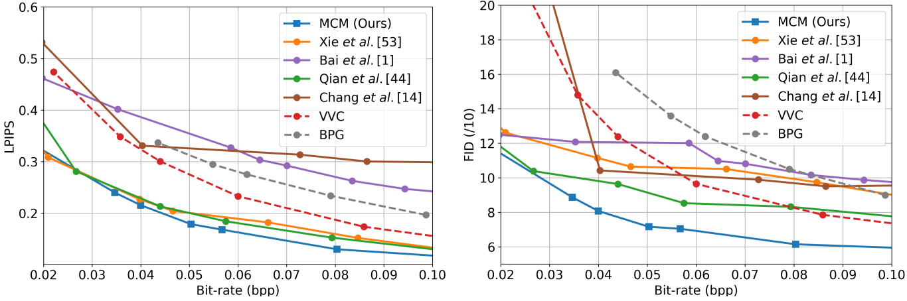

# MCM

This is the Pytorch implementation of the paper "**You Can Mask More For Extremely Low-Bitrate Image Compression**". 
[[Arxiv Paper](https://arxiv.org/abs/2306.15561)]

This repo defines the **Masked Compression Model
(MCM)** for extremely low-bitrate image compression in the paper above.



# Dependencies and Installation
```
conda create -n MCM python=3.7
conda activate MCM
pip install compressai
pip install pybind11
git clone https://github.com/lianqi1008/MCM.git
cd MCM
pip install -r requirements.txt
pip install -e .
pip install -e '.[dev]'
```
# Get Started
## Preparation
Generate the patch scores:
```
python util/score_cal.py -d0 path/to/image -d1 path/to/structure -d2 path/to/save/score
```
The final file structure is as follows:
```
checkpoint
    |- pretrained
        |- pretrained.pth
    |- finetuned
        |- coco
            |- xxx.pth
            |- ...
        |- celeba
            |- xxx.pth
            |- ...
dataset
    |- coco
        |- images
            |- train
            |- test
        |- scores
        |- structure|- coco
    |- celeba
```
## Train
Train from scratch and please download the pretrained model from original [MAE's repo](https://github.com/facebookresearch/mae) or download the model we copied(
[[Baidu cloud](https://arxiv.org/abs/2306.15561)]). And please put it in ./checkpoint/pretrained/.
```
CUDA_VISIBLE_DEVICES=0 python main_compress.py \
-m MCM -d ./dataset/coco -e 100 --batch_size 32 \
--checkpoint ./checkpoint/pretrained/pretrain_vit_base.pth \
--output_dir dirpath/to/save/checkpoint \
--log_dir dirpath/to/save/logs --cuda
```
## Inference
If you want to load our finetuned models, please download from [[Baidu cloud](链接：https://pan.baidu.com/s/1g0WL5OxNP8rh4fvnYSOiKg?pwd=pbd9)] and put in ./checkpoint/finetuned/.

Note that '--exp_name' is the location where the bit stream of the token index is saved, you can name it arbitrarily, and you can delete the folder after inference, which is not important.

"Inference on GPU is not recommended for the autoregressive models (the entropy coder is run sequentially on CPU)."(mentioned in CompressAI), so please run on CPU for inference.
```
CUDA_VISIBLE_DEVICES=0 python -m compressai.utils.eval_model \
-a MCM -d './dataset/coco/' -r dirpath/to/output \
-p './checkpoint/finetuned/coco/checkpoint_xxx.pth' \
--exp_name coco --vis_num 144 --cuda
```
<!-- ## Dataset
We evaluate the perforamce of the method on [MS COCO 2014](https://cocodataset.org) and [CelebAMask-HQ](https://github.com/switchablenorms/CelebAMask-HQ). Both the images and annotations are needed. For more details, please check out the experimental setup of our paper. -->


# Results
### Qualitative Results





### Quantitative Results
RD performance on CelebAMask-HQ dataset.



RD performance on COCO dataset.


# Citation
```
@misc{li2023mask,
      title={You Can Mask More For Extremely Low-Bitrate Image Compression},
      author={Anqi Li and Feng Li and Jiaxin Han and Huihui Bai and Runmin Cong and Chunjie Zhang and Meng Wang and Weisi Lin and Yao Zhao},
      year={2023},
      eprint={2306.15561},
      archivePrefix={arXiv},
      primaryClass={cs.CV}
 }  
```
# Related Links
MAE: https://github.com/facebookresearch/mae.git  
CompressAI: https://github.com/InterDigitalInc/CompressAI  
Tensorflow compression library: https://github.com/tensorflow/compression  
MS COCO Dataset: https://cocodataset.org  
CelebAMask-HQ Dataset: https://github.com/switchablenorms/CelebAMask-HQ  